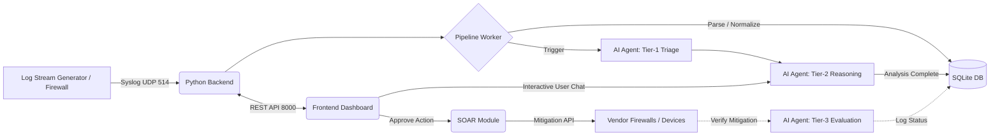

# SOCrates
*We are GitHappens and this is SOCrates, an Intelligent, Auto-Triaging Security Operations Center (SOC) built with React, Python, and Multi-Agent GenAI.*

## Overview

SOCrates is an end-to-end, AI-enabled Security Information and Event Management (SIEM) and Security Orchestration, Automation, and Response (SOAR) platform. It was designed to alleviate alert fatigue by ingesting network logs, independently performing sophisticated triage using LLM agents, and allowing analysts to interact with alerts and implement mitigations through a conversational interface.

### Key Features
- **Intelligent Triage & Analysis**: Uses autonomous GenAI agents (like `gpt-4.1` / `gpt-5.1`) to parse incoming syslog streams, normalize fields, identify attack vectors, and perform 3-tiered real time analysis of your network:
   - ***Tier-1:***  Fast Filtering (Batches of logs are assessed for threats)
   - ***Tier-2:***  Deep Reasoning (suspicious data, considering the context of the network undergo in depth analysis and mitigation steps are suggested)
   - ***Tier-3:***  Post-Mitigation Evaluation (To verify if an attack was successfully stopped)
- **SOAR Automated Mitigation**: SOCrates integrates actively with endpoints and network appliances (Windows, Cisco, FortiGate, PaloAlto) to execute active containment playbooks or ad-hoc mitigation commands straight from the chat module using natural language (Include your respective API tokens in backend/.env (e.g., FORTIGATE_API_TOKEN) to activate these paths).
- **Log Stream Simulator**: Included right in the repo is a fully featured *Log Stream Generator* that translates academic IDS datasets (like CIC-IDS-2017) into hyper-realistic FortiGate/Palo Alto formats and streams them natively into the backend via Syslog to simulate log of a network under attack.
- **Modern Web Dashboard**: A fast, responsive frontend dashboard built using React, Vite, Tailwind CSS, and Recharts, that contains the stats overview, the Ai analyses, a network topology visualization and all parsed logs. 

### Live Demo
Check out the frontend populated with mock data here: **[SOCrates Live Dashboard](https://socrates-ef2b.onrender.com/dashboard)**.  
To switch it to live data, click the **Settings** icon in the bottom left of the sidebar and enter your backend's API URL (if exposed).

## Architecture



## Docker Setup

The easiest way to run the entire stack (Frontend, Backend, and the Log Engine) is using Docker. Ensure Docker is installed via [Docker Desktop](https://docs.docker.com/desktop/) and make sure the Docker desktop application is running in the background before executing the commands below.

**Important:** Open your terminal with **administrator privileges** in the root project folder so the SOAR module can successfully execute system-level mitigation commands if needed.

### 1. Configure the Environment
Create `.env` files for both the frontend and backend.

**`backend/.env`**
```env
OPENAI_API_KEY=sk-...           # ADD YOUR OPENAI API KEY
OPENAI_MODEL_PARSER=gpt-4.1     
OPENAI_MODEL_AGENT=gpt-4.1      # for Tier-1 triage
OPENAI_MODEL_REASONING=gpt-5.1  # for Tier-2 deep analysis + chat
SYSLOG_HOST=0.0.0.0
SYSLOG_PORT=514        # Windows requires Admin for port 514. Change to 5514 if unprivileged.
API_HOST=0.0.0.0
API_PORT=8000          # Internal container API port
```

**`frontend/.env`**
```env
VITE_BACKEND_URL=http://localhost:8000 # URL where frontend expects the backend REST API
```

### 2. Spin Up the Stack
To run the **Frontend + Backend**:
```bash
docker compose up --build
```
To run the **Frontend + Backend + Log Simulator** (A condensed testing dataset is already provided at `data/cic-collection.parquet`):
```bash
docker compose --profile simulator up --build
```

**Services will be available at:**
- **Frontend Dashboard:** http://localhost:5173
- **Backend API:** http://localhost:8000
- **Log Simulator Status:** http://localhost:5050

Stop the containers at any time using: `Ctrl^C` or `docker compose down`


## Manual Setup

If you prefer to run services individually without Docker (e.g. for development):

### Backend
1. **Install requirements:**
   ```powershell
   pip install -r backend/requirements.txt
   ```
2. **Start the backend server:** *(from project root)*
   ```powershell
   python -m backend.main
   ```
   *This starts the Syslog listener on port 514, the Flask REST API on port 8000, and auto-initializes the DB at `backend/database/socrates.db`.*

### Frontend
1. **Install modules & run Vite:**
   ```powershell
   cd frontend
   npm install
   npm run dev
   ```

### Simulating Logs
You can generate test loads by running our custom log engine directly from the root namespace in a separate terminal:
```powershell
python -m tools.Log_Stream_Generator --parquet data/cic-collection.parquet --syslog --syslog-host 127.0.0.1 --syslog-port 514 --max-flows 1000 --speed 1
```
Use `--from paloalto` or `--from fortigate` to simulate different hardware. Find more information in the [Log Stream Generator README](tools/Log_Stream_Generator/README.md).

---

## 🛡️ SOAR Capabilities
SOCrates isn't purely observational. The backend encompasses an extensive `services/vendors/` suite containing drivers for common infrastructure (Cisco, FortiGate, Windows, Palo Alto). Through our AI chat panel, SOC analysts can command firewalls to push blanket bans on identified malicious signatures or automatically restrict compromised client endpoints organically. Include your respective API tokens in `backend/.env` (e.g., `FORTIGATE_API_TOKEN`) to activate these paths!


