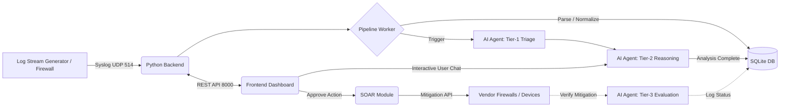

# SOCrates
SOCrates is our submission for the 2026 Thessaloniki Netcompany Hackathon. A system that automates the daily life of a SOC expert, while keeping him at the center of decision-making.

Our goal is the optimal evaluation of security alerts and the most immediate possible response to each threat. Your SOC AI assistant!

*An Intelligent, Auto-Triaging Security Operations Center (SOC) built with React, Python, and Multi-Agent GenAI.*

---

### 🚀 Live Demo
Check out the frontend populated with mock data here: **[SOCrates Live Dashboard](https://socrates-ef2b.onrender.com/dashboard)**.  
To switch it to live data, click the **Settings** icon in the bottom left of the sidebar and enter your backend's API URL (if exposed).

---

## 📖 Overview

SOCrates is an end-to-end, AI-enabled Security Information and Event Management (SIEM) and Security Orchestration, Automation, and Response (SOAR) platform. It was designed to alleviate alert fatigue by ingesting network logs, independently performing Tier-1 and Tier-2 triage using LLM agents, and allowing analysts to interact with alerts through a conversational interface.

### ✨ Key Features
- **Intelligent Triage & Analysis**: Uses autonomous GenAI agents (like `gpt-4.1` / `gpt-5.1`) to parse incoming syslog streams, normalize fields, identify attack vectors, and perform fully automated tier-1 (fast filtering), tier-2 (deep reasoning) triage, and tier-3 (post-mitigation evaluation) to verify if an attack was successfully stopped.
- **SOAR Automated Mitigation**: Act on threats instantly! SOCrates integrates actively with endpoints and network appliances (Cisco, FortiGate, PaloAlto, Windows) to execute active containment playbooks or ad-hoc mitigation commands straight from the chat module.
- **Log Stream Simulator**: Included right in the repo is a fully featured *Log Stream Generator* that translates academic IDS datasets (like CIC-IDS-2017) into hyper-realistic FortiGate/Palo Alto formats and streams them natively into the backend via Syslog.
- **Modern Web Dashboard**: A fast, responsive frontend dashboard built using React, Vite, Tailwind CSS, and Recharts.

---

## 🏗️ Architecture



---

## 🛠️ Quick Start (Docker Recommended)

The easiest way to run the entire stack (Frontend, Backend, and the Log Engine) is using Docker. Ensure Docker is installed via [Docker Desktop](https://docs.docker.com/desktop/) and **make sure the Docker desktop application is running in the background** before executing the commands below.

**⚠️ Important:** Open your terminal with **administrator privileges** in the root project folder so the SOAR module can successfully execute system-level mitigation commands if needed.

### 1. Configure the Environment
Create `.env` files for both the frontend and backend.

**`backend/.env`**
```env
OPENAI_API_KEY=sk-...           # Required
OPENAI_MODEL_PARSER=gpt-4.1     # Template generation
OPENAI_MODEL_AGENT=gpt-4.1      # Tier-1 triage
OPENAI_MODEL_REASONING=gpt-5.1  # Tier-2 deep analysis + chat
SYSLOG_HOST=0.0.0.0
SYSLOG_PORT=514                 # Windows requires Admin for port 514. Change to 5514 if unprivileged.
API_HOST=0.0.0.0
API_PORT=8000                   # Internal container API port
```
> *(Optional: see `backend/README.md` for advanced SOAR keys and configs).*

**`frontend/.env`**
```env
# URL where the frontend expects to reach the backend REST API
VITE_BACKEND_URL=http://localhost:8000
```

### 2. Prepare the Dataset
A condensed testing dataset is already provided at `data/cic-collection.parquet` for instant testing. Check for exact case sensitivity, especially on Linux, if you add your own dataset.

### 3. Spin Up the Stack
To run the **Frontend + Backend**:
```bash
docker compose up --build
```
To run the **Frontend + Backend + Log Simulator** (streams mock firewall events):
```bash
docker compose --profile simulator up --build
```

**Services will be available at:**
- **Frontend Dashboard:** http://localhost:5173
- **Backend API:** http://localhost:8000
- **Log Simulator Status:** http://localhost:5050 (if profile used)

Stop the containers at any time using: `docker compose down`

---

## 💻 Manual Setup

If you prefer to run services individually without Docker (e.g. for development):

### Backend
1. **Install requirements:**
   ```powershell
   pip install -r backend/requirements.txt
   ```
2. **Start the backend server:** *(from project root)*
   ```powershell
   python -m backend.main
   ```
   *This starts the Syslog listener on port 514, the Flask REST API on port 8000, and auto-initializes the DB at `backend/database/socrates.db`.*

### Frontend
1. **Install modules & run Vite:**
   ```powershell
   cd frontend
   npm install
   npm run dev
   ```

### Simulating Logs
You can generate test loads by running our custom log engine directly from the root namespace in a separate terminal:
```powershell
python -m tools.Log_Stream_Generator --parquet data/cic-collection.parquet --syslog --syslog-host 127.0.0.1 --syslog-port 514 --max-flows 1000 --speed 1
```
Use `--format paloalto` or `--format fortigate` to simulate different hardware. Find more information in the [Log Stream Generator README](tools/Log_Stream_Generator/README.md).

---

## 🛡️ SOAR Capabilities
SOCrates isn't purely observational. The backend encompasses an extensive `services/vendors/` suite containing drivers for common infrastructure (Cisco, FortiGate, Windows, Palo Alto). Through our AI chat panel, SOC analysts can command firewalls to push blanket bans on identified malicious signatures or automatically restrict compromised client endpoints organically. Include your respective API tokens in `backend/.env` (e.g., `FORTIGATE_API_TOKEN`) to activate these paths!


